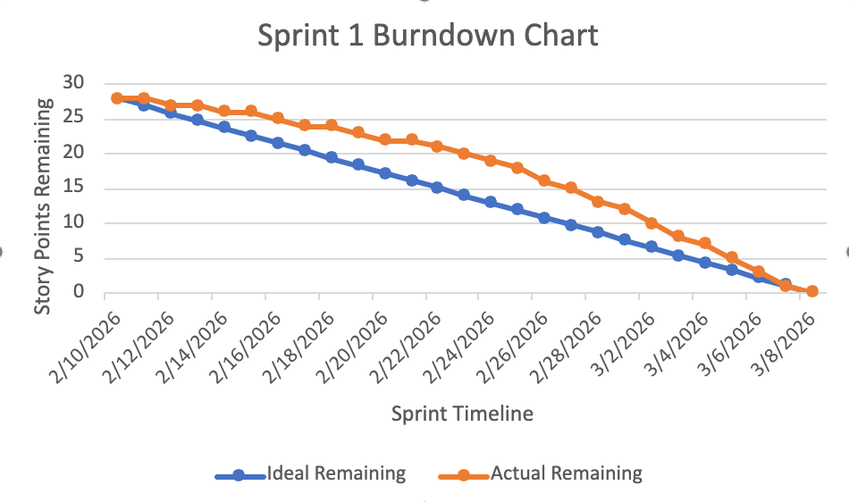
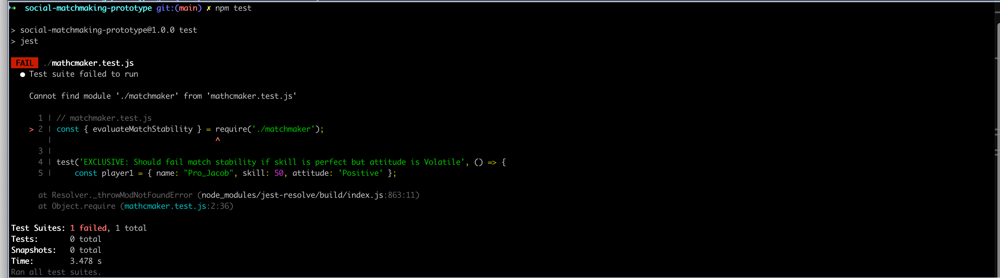

# Social Matchmaking Prototype – Sprint 1

This repository contains the **Sprint 1 prototype implementation** for the Social Matchmaking system.

The goal of Sprint 1 was to establish the foundational backend service using **Node.js and Express**, while following **Agile Scrum practices** and **Test-Driven Development (TDD)**.

---

# 🚀 Working Prototype (Sprint 1)

Access the working Sprint 1 prototype here:

https://github.com/EazyW96/social-matchmaking-prototype/tree/sprint-1/Docs/sprint-1

---

# Sprint 1 Planning

## Kanban Board

Sprint backlog and task board:

[Trello Sprint Board](https://trello.com/b/kbPXcjh0/social-matchmaking-sprint-1)

This board contains the **user stories, tasks, and progress tracking** for Sprint 1.

---

## Sprint Forecast

**Forecast:** 28 Story Points

**Rationale**

Our team focused on building the foundational Node.js backend environment, implementing the core Web Service API endpoints, and defining user behavior data structures.

This ensures we have a stable prototype before the **March 8, 2026 deadline**.

---

# Sprint 1 Burndown Chart

The burndown chart tracks the number of story points remaining throughout the sprint.

- X-Axis → Sprint Days  
- Y-Axis → Remaining Story Points  

---

# Task Decomposition

## Core Backend Tasks

- Set up Node.js and Express server  
- Create base API routing structure  
- Implement API home endpoint (`/`)  
- Implement `/players` endpoint using mock player data  
- Implement `/match` endpoint for compatibility evaluation  
- Organize project structure for routes, services, and data  

## User Profile Tasks

- Design JSON schemas for player behavior and play-style  
- Build functions for storing and retrieving player data  
- Implement data models for matchmaking inputs  
- Create mock player profiles for testing and demonstration  

---

# Implementation Progress

## Test-First Development (TDD)

The test initially failed, confirming that the behavior was not yet implemented.

---

# Unit Testing

The project uses **Jest** for automated testing.

## Run tests using:

npm test

The repository includes **more than 10 passing unit tests** as required by the sprint rubric.

---

# Pair Programming / Collaboration Evidence

The team collaborated through meetings and shared development sessions while building the API and testing components.

---

# Sprint 1 Meeting Evidence

**Meeting Date:** March 7, 2026  
**Platform:** Microsoft Teams  

### Participants

- Elliotte Wideman  
- Gabriel Jean-Louis  
- Steve Seukap Dieuyou  

---

# Daily Scrum Evidence

### What did you complete in the last 24 hours?

- Elliotte Wideman implemented the Express server and routing  
- Gabriel Jean-Louis researched matchmaking concepts for reference  
- Steve Dieuyou worked on the player profile schema  

### What will you complete in the next 24 hours?

- Implement the /players endpoint  
- Integrate matchmaking service logic  
- Add unit tests  

### Impediments

- Initial uncertainty regarding API structure  
- Resolved through team discussion  

---

# Working Software Increment

The Sprint 1 prototype includes a **working Node.js REST API built using custom logic and mock data**.

---

# API Prototype Demonstration

## API Home Endpoint

Endpoint:

GET http://localhost:3000/

Example Response:

{
  "message": "Social Matchmaking API",
  "description": "Sprint 1 prototype matchmaking service",
  "endpoints": {
    "getPlayers": "GET /players",
    "createMatch": "POST /match"
  }
}

---

## GET /players

Endpoint:

GET http://localhost:3000/players

Example Response:

[
  {
    "id": 1,
    "username": "AcePlayer",
    "age": 22,
    "skillLevel": "Intermediate",
    "behaviorScore": 8,
    "preferredGameModes": ["Ranked","Duo"],
    "availability": "Evenings",
    "region": "NA-East",
    "platform": "PC",
    "bio": "Competitive team player."
  }
]

---

## API Demonstration

### POST /match

Endpoint:

POST http://localhost:3000/match

Example Request Body:

{
  "playerA": {
    "name": "AcePlayer",
    "skill": 50,
    "attitude": "Positive"
  },
  "playerB": {
    "name": "ProJacob",
    "skill": 48,
    "attitude": "Positive"
  }
}

Example Response:

{
  "compatible": true,
  "skillDifference": 2,
  "attitudeMatch": true,
  "score": 2
}

This demonstrates the custom matchmaking logic implemented in `src/services/matchmaker.js` using mock player data for Sprint 1.
