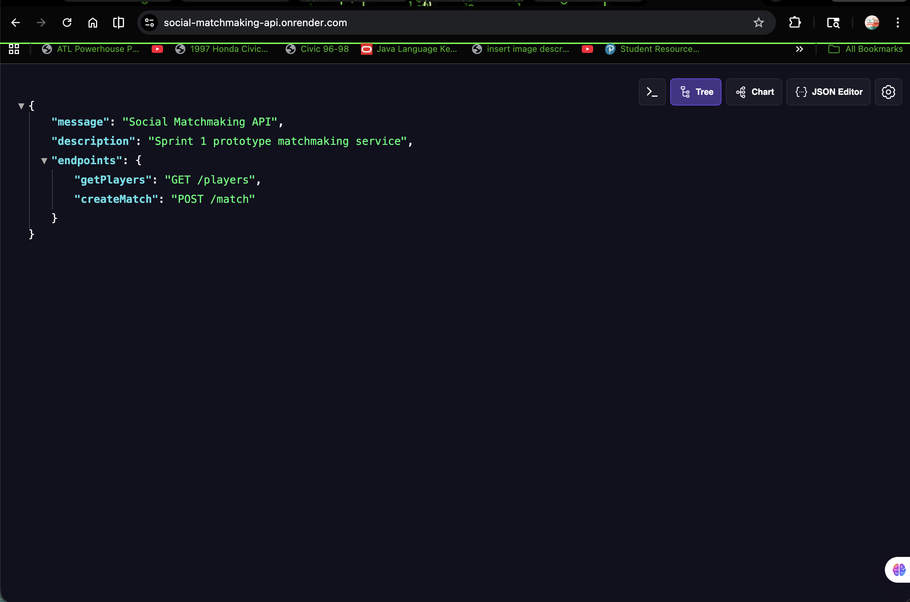
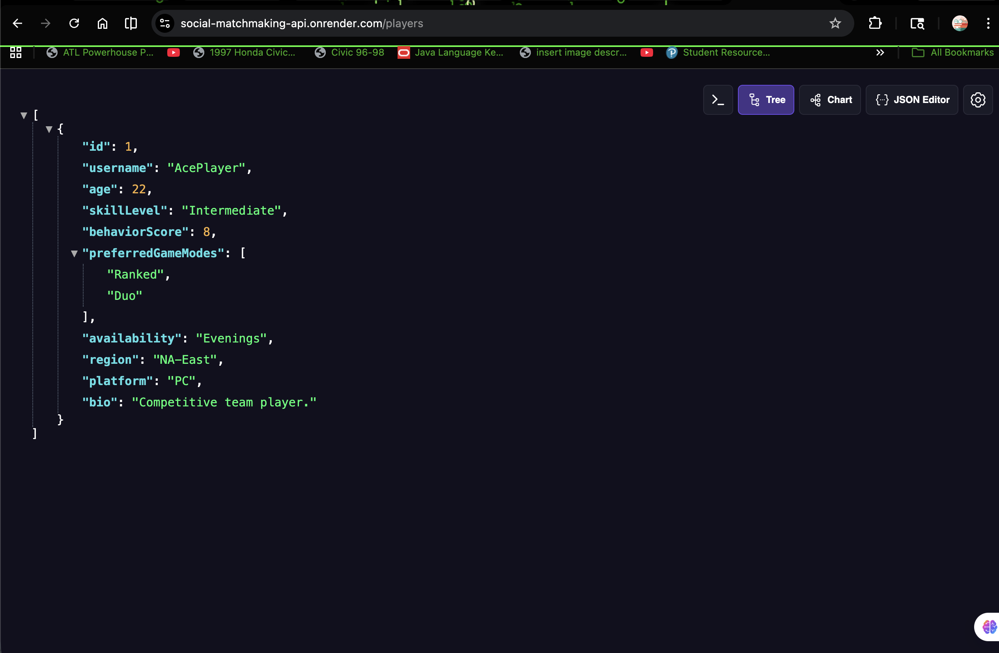
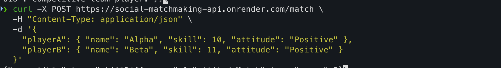
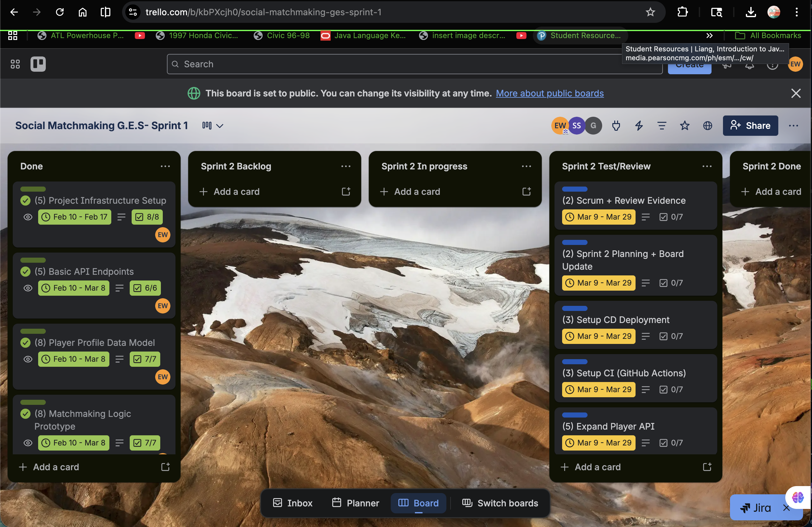
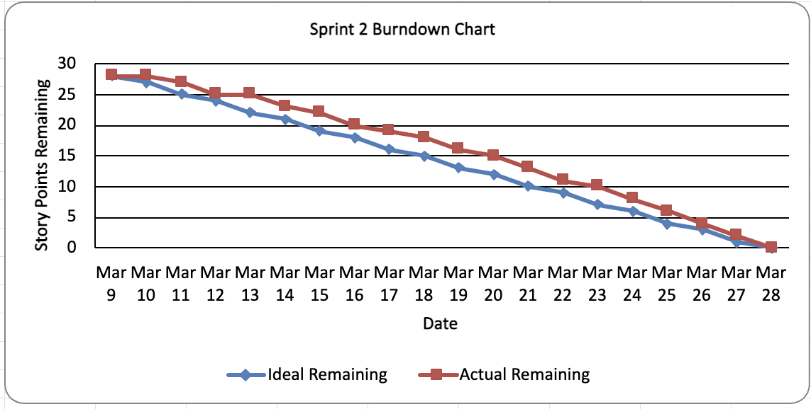
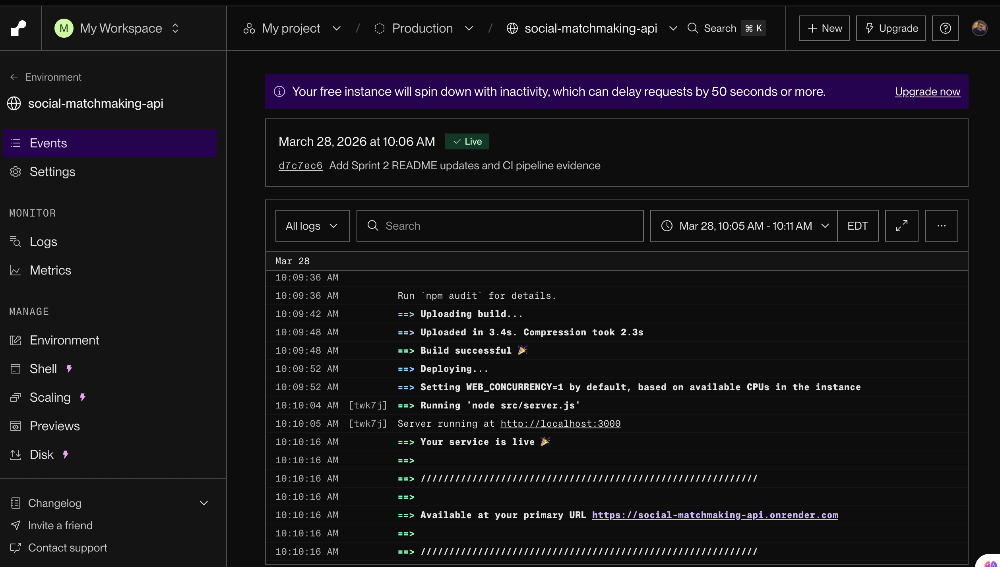
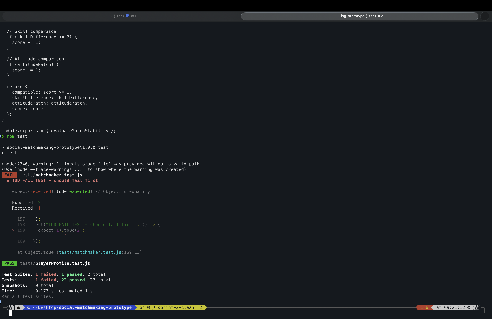

## 📊 Sprint 2 Artifacts & Evidence

This section provides visual and functional evidence of the system implementation, testing practices, and deployment pipeline for Sprint 2.

---

## 🌐 Deployed API (Production Evidence)

The Social Matchmaking API was successfully deployed to a production-like environment using Render. The following endpoints were tested and verified:

- `GET /` – API overview
- `GET /players` – Retrieve player data
- `POST /match` – Evaluate matchmaking compatibility

### API Home Endpoint


### API Players Endpoint


### API Match Endpoint


---

## 📋 Kanban Board (Sprint Backlog & Task Tracking)

The team used Trello to manage sprint backlog, task decomposition, and progress tracking.

🔗 Trello Board: https://trello.com/b/kbPXcjh0/social-matchmaking-sprint-1

The board includes:
- Sprint backlog (stories → tasks)
- Work in progress tracking
- Testing and review stages



---

## 📉 Sprint Burndown Chart

A burndown chart was created to track daily progress across the sprint (March 9 – March 28).

- X-axis: Sprint days
- Y-axis: Remaining story points
- Blue line: Ideal progress
- Red line: Actual progress

The chart demonstrates steady progress toward sprint completion.



---

## 🔁 Continuous Integration (CI)

A CI pipeline was implemented using GitHub Actions.

### CI Features:
- Automatically triggers on push
- Installs dependencies
- Executes Jest test suite
- Ensures code quality and build stability

The successful pipeline run is shown below:


---

## 🚀 Continuous Deployment (CD)

Continuous Deployment was implemented using Render.

### CD Features:
- Automatic deployment from GitHub repository
- Production environment provisioning
- Live endpoint verification

The deployment logs confirm that the application is running successfully in production:



---

## 🌍 Live API Access (Try It Yourself)

The Social Matchmaking API is deployed to a production environment and publicly accessible. You can test the available endpoints below:

- 🔗 **API Base URL:**  
  https://social-matchmaking-api.onrender.com/

- 🔗 **Players Endpoint (GET):**  
  https://social-matchmaking-api.onrender.com/players

> ⚠️ The `/match` endpoint requires a POST request and cannot be accessed directly from the browser. Use tools like Postman or curl to test it.

This deployment demonstrates full CI/CD integration, enabling automated testing and continuous delivery to a live production environment.

---

## 🧪 Example Test (POST Request)

You can test the matchmaking endpoint using curl:

```bash
curl -X POST https://social-matchmaking-api.onrender.com/match \
-H "Content-Type: application/json" \
-d '{"player1": "A", "player2": "B"}'

## 🧪 Test-Driven Development (TDD)

The team followed a Test-Driven Development (TDD) approach:

1. Write failing test cases (Red phase)
2. Implement functionality (Green phase)
3. Refactor code

### Evidence of TDD (Failing Test)

The following screenshot shows a failing test case before implementation was completed, demonstrating the test-first approach:

