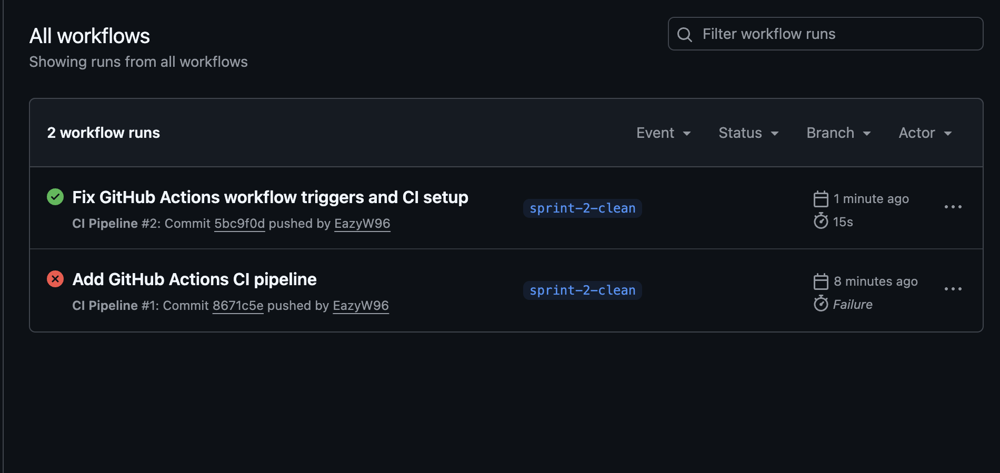

# Sprint 2 – Social Matchmaking Prototype

## Sprint Goal
Enhance the existing prototype by expanding API functionality, improving matchmaking logic, increasing test coverage, and implementing CI/CD while following Agile Scrum practices.

---

## 1. Sprint 2 Forecast (Yesterday’s Weather)

Sprint 1 Completed: 28 story points  
Sprint 2 Forecast: 28 story points  

Rationale:
The team successfully completed all 28 story points in Sprint 1. Based on the Yesterday’s Weather forecasting method, we maintained the same velocity for Sprint 2.

---

## 2. Sprint Backlog (Stories and Tasks)

The Sprint 2 backlog was created and tracked using a Kanban board.

### Stories:
- Expand Player API (5 pts)
- Enhance Matchmaking Logic (5 pts)
- Add 10 Unit Tests (5 pts)
- Add 1 BDD Test (3 pts)
- Setup CI (3 pts)
- Setup CD Deployment (3 pts)
- Sprint Planning & Board Update (2 pts)
- Scrum & Review Evidence (2 pts)

Each story was decomposed into detailed tasks (see Kanban board).

📸 Evidence:
- artifacts/kanban_sprint2.png (to be added)

---

## 3. Sprint Burndown Chart

A burndown chart will track progress over the sprint.

- X-axis: Days (Day 1–3)
- Y-axis: Remaining story points

📸 Evidence:
- artifacts/burndown_sprint2.png (to be added)

---

## 4. Daily Scrums

The team conducts daily scrums to track progress.

Each scrum includes:
- Work completed in the last 24 hours
- Planned work for the next 24 hours
- Identified impediments and resolution plans

📄 Evidence:
- scrum-notes/daily-scrum-2026-03-28.md (to be added)

---

## 5. Pairing / Mobbing Evidence

The team collaborates using pairing/mobbing techniques during development.

📸 Evidence:
- meeting-evidence/Sprint2_pairing.PNG (to be added)

---

## 6. Test-Driven Development (TDD) and BDD

The team follows a test-first approach:

- Write failing tests first (TDD red phase)
- Implement code to pass tests
- Add at least 10 new unit tests
- Add at least 1 new BDD test

📸 Evidence:
- artifacts/tdd-red-phase-sprint2.png (to be added)

---

## Continuous Integration (CI)

We implemented a CI pipeline using GitHub Actions. The pipeline automatically builds the project and runs all unit tests on every push and pull request.

📸 Evidence:

---

## 8. Continuous Deployment (CD)

The application will be deployed to a production-like environment.

- Live API deployed (Render/Railway)
- Deployment verified and tested

📸 Evidence:
- artifacts/cd-deployment-sprint2.png (to be added)

---

## 9. Sprint Review

The team will conduct a Sprint Review to evaluate progress and demonstrate completed features.

📸 Evidence:
- meeting-evidence/Sprint2_review.PNG (to be added)

---

## 10. Team Video Presentation

The team will record a Sprint Overview presentation summarizing:

- Sprint goal
- Key accomplishments
- Walkthrough of all rubric items

🎥 Video Link:
- (to be added)

---

## Summary

Sprint 2 focuses on extending the prototype, improving test coverage, implementing CI/CD, and documenting Agile practices. All required evidence will be captured and included in this repository.