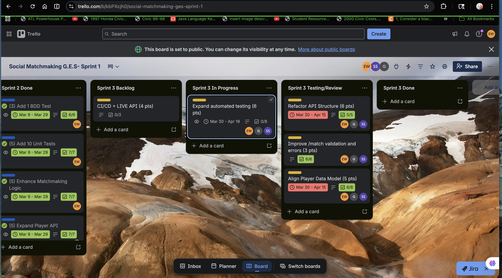
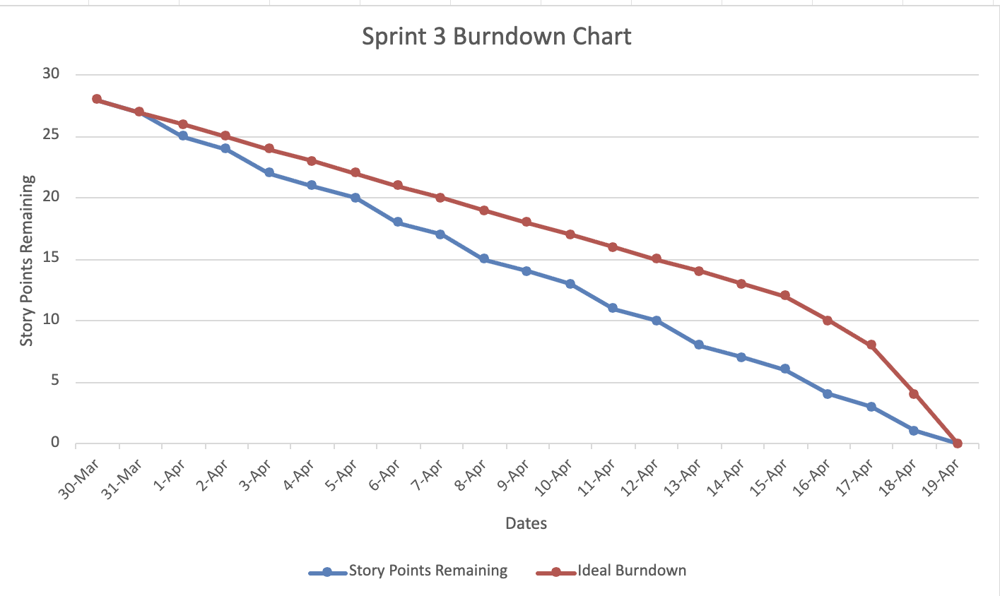
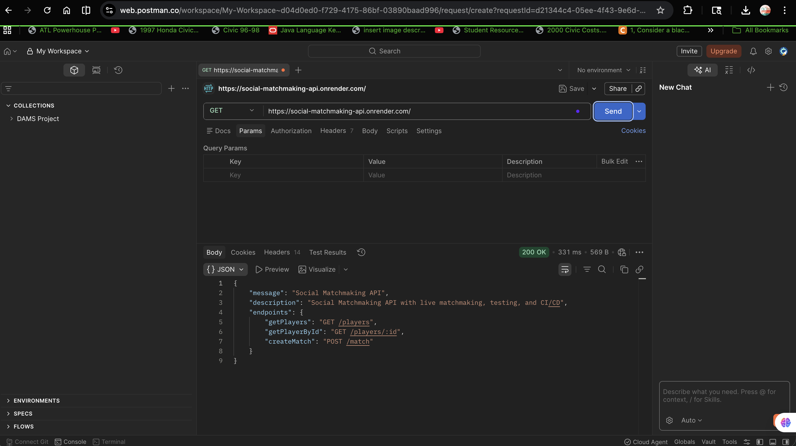
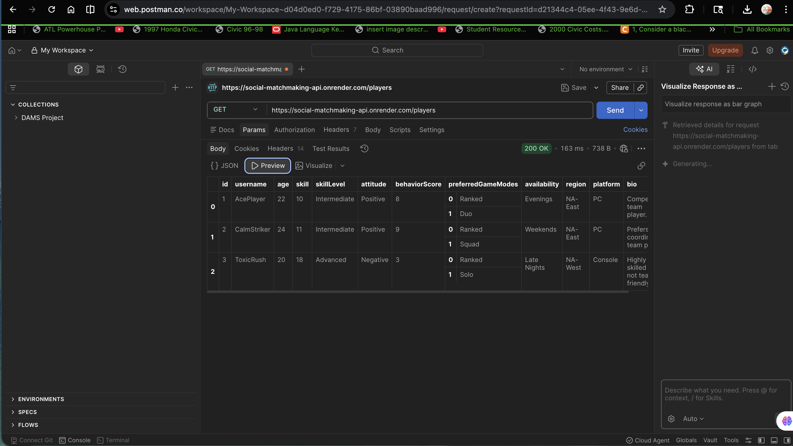
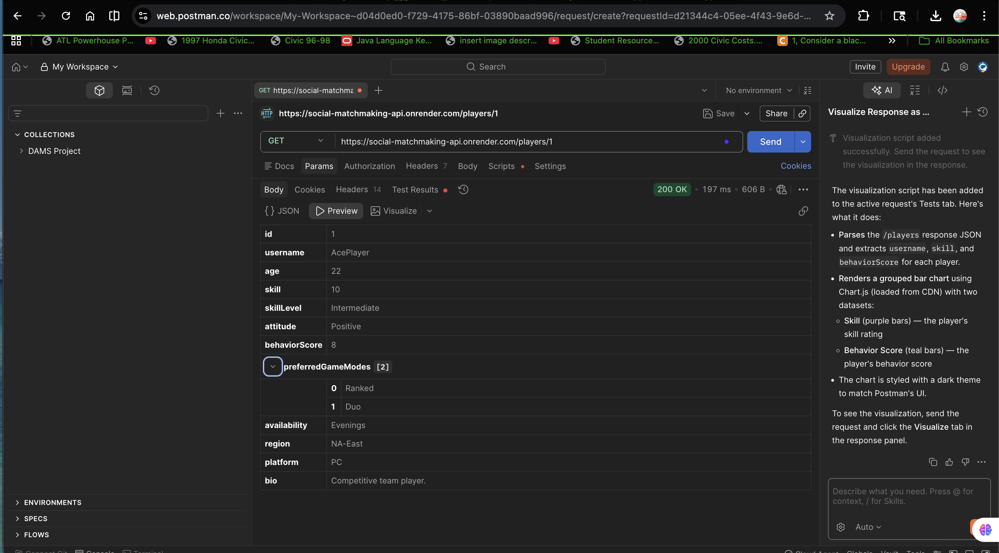
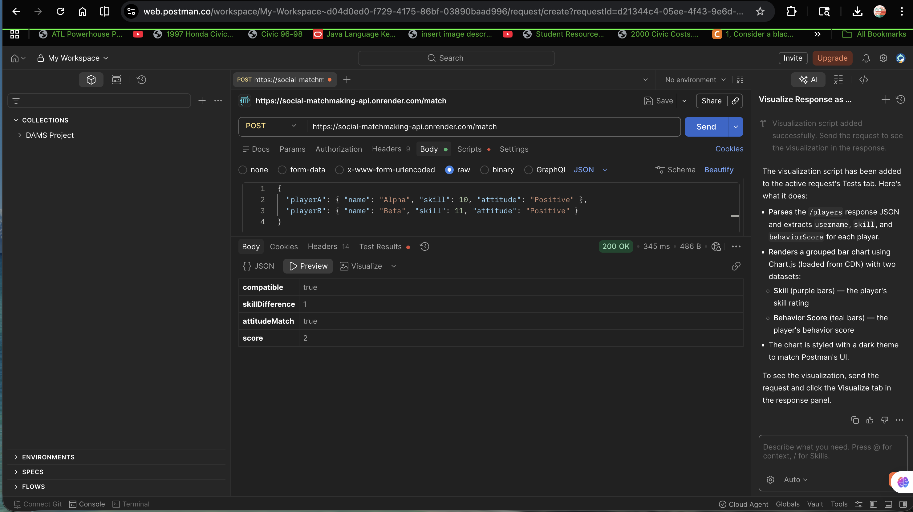
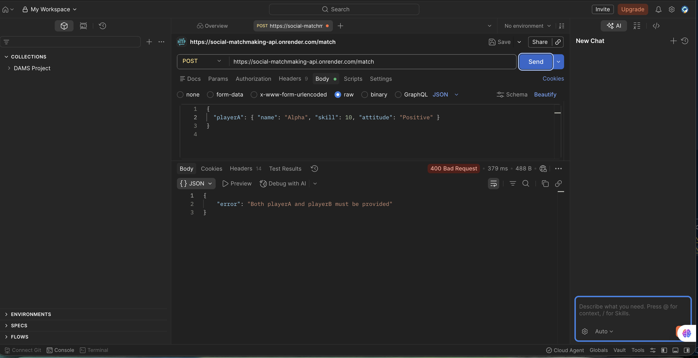
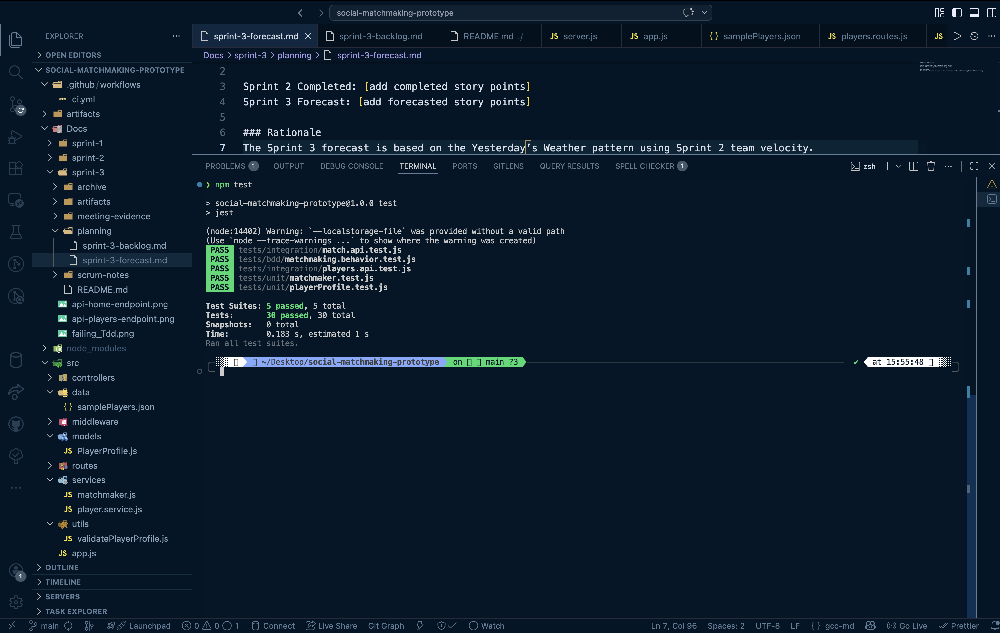
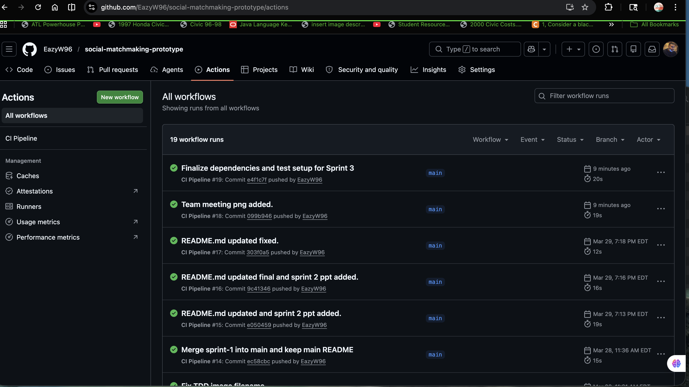
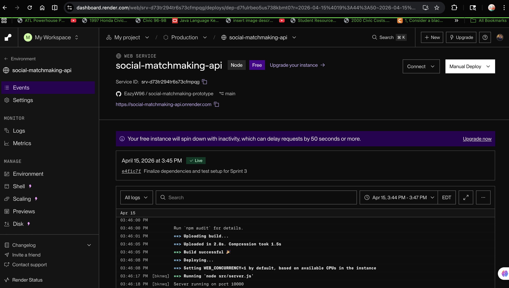

# Sprint 3 – Social Matchmaking Prototype

## Sprint Goal
Complete the Social Matchmaking Prototype by finalizing features, improving architecture, expanding test coverage, validating CI/CD, and preparing the system as a complete software solution ready for customer review.

---

## Sprint Forecast

Sprint 2 Completed: 28 story points  
Sprint 3 Forecast: 28 story points  

### Rationale
The Sprint 3 forecast is based on the Yesterday’s Weather pattern using Sprint 2 velocity. Since the team completed 28 story points in Sprint 2, the same value was used for Sprint 3 to maintain a realistic and achievable workload.

---

## Sprint Backlog

Stories and tasks were defined and tracked using the Kanban board and aligned with Sprint 3 goals.

---

## Kanban Board

The Kanban board shows all Sprint 3 stories and tasks, including their progress across backlog, in-progress, and completed stages.

---

## Burndown Chart

The burndown chart tracks daily progress from March 30 to April 19.

- X-axis: Dates (daily intervals)  
- Y-axis: Story points remaining  
- Includes both **actual progress** and **ideal burndown line**

---

## API Testing (Postman)

The deployed API was tested using Postman against the live Render environment to verify endpoint functionality, validation, and error handling.

### Root Endpoint

### Get All Players

### Get Player by ID

### Player Not Found (Error Handling)

### Matchmaking (Success)

### Matchmaking (Validation Error)

---

## Daily Scrums

Daily scrum notes were recorded and include:
- Work completed
- Planned work
- Impediments and resolutions

(See `scrum-notes` folder for detailed logs)

---

## Pairing / Mobbing Evidence

Team collaboration was conducted through pairing and group debugging sessions.

(Evidence located in `meeting-evidence` folder)

---

## TDD / BDD

The system follows a test-first development approach:

- 30+ unit tests implemented  
- Integration tests for endpoints  
- BDD-style test included  
- All tests passing  

---

## Continuous Integration

GitHub Actions automatically builds and tests the application on each push to main.

---

## Continuous Deployment

The application is deployed to a live environment using Render and verified through API testing.

---

## Sprint Review

The Sprint Review demonstrated:
- Completed features
- Working API endpoints
- Test coverage
- Deployment readiness

(Evidence located in `meeting-evidence` folder)

---

## Complete Software Solution

The final system includes:

- Matchmaking API  
- Player profile system  
- Input validation and error handling  
- Automated testing suite  
- CI/CD pipeline  
- Live deployment  

---

## Team Video Presentation

The Sprint 3 presentation covers:
- Sprint overview  
- Architecture improvements  
- Testing strategy  
- CI/CD pipeline  
- Live demo  

📌 YouTube Link: (add your link here)