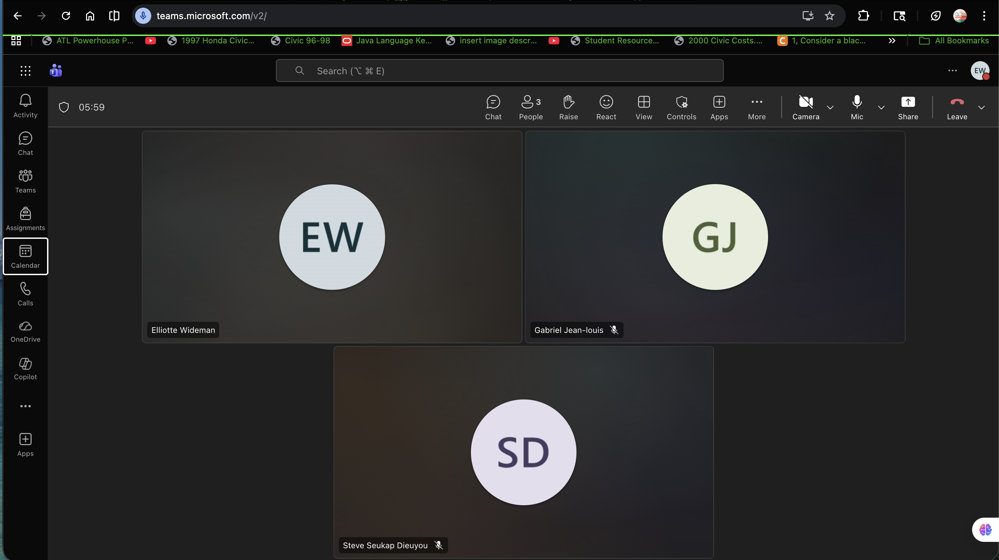
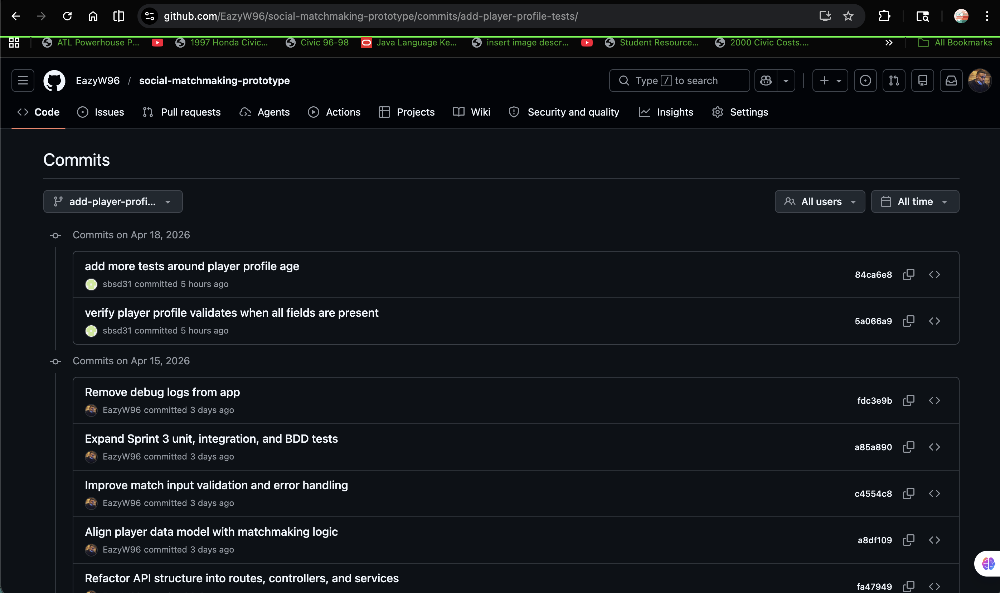

# Sprint 3 – Social Matchmaking Prototype

## Sprint Goal

Complete the Social Matchmaking Prototype by finalizing features, improving architecture, expanding test coverage, validating CI/CD, and preparing the system as a complete software solution ready for customer review.

---

## Sprint Forecast

Sprint 2 Completed: 28 story points  
Sprint 3 Forecast: 28 story points

### Rationale

The Sprint 3 forecast is based on the Yesterday’s Weather pattern using Sprint 2 velocity. Since the team completed 28 story points in Sprint 2, the same value was used for Sprint 3 to maintain a realistic and achievable workload.

---

## Sprint Backlog

Stories and tasks were defined and tracked using the Kanban board and aligned with Sprint 3 goals.

---

## Kanban Board

The Kanban board shows all Sprint 3 stories and tasks, including their progress across backlog, in-progress, and completed stages.

🔗 Trello Board: [View Sprint 3 Kanban Board](https://trello.com/invite/b/698b6f9a82a7860b17796ea6/ATTI43e56bf38e6ce4f1e635df06e86ef322AB491991/social-matchmaking-ges-sprint-1)

---

## Burndown Chart

The burndown chart tracks daily progress from March 30 to April 19.

- X-axis: Dates (daily intervals)
- Y-axis: Story points remaining
- Includes both **actual progress** and **ideal burndown line**

---

## API Testing (Postman)

The deployed API was tested using Postman against the live Render environment to verify endpoint functionality, validation, and error handling.

Base URL:  
https://social-matchmaking-api.onrender.com

---

### Root Endpoint

GET https://social-matchmaking-api.onrender.com/

Confirms the API is running and returns available endpoints.

---

### Get All Players

GET https://social-matchmaking-api.onrender.com/players

Retrieves all players in the system.

---

### Get Player by ID

GET https://social-matchmaking-api.onrender.com/players/1

Retrieves a specific player by ID. Returns 404 if not found.

---

### Matchmaking (Success)

POST https://social-matchmaking-api.onrender.com/match

Evaluates compatibility between two players.

---

### Matchmaking (Error Handling)

POST https://social-matchmaking-api.onrender.com/match

Handles invalid input such as missing fields or incorrect data types.

---

## Daily Scrums

Daily scrum notes were recorded and include:

- Work completed
- Planned work
- Impediments and resolutions

Example Scrum Evidence:

(See `scrum-notes` folder for detailed logs)

---

## Pairing / Mobbing Evidence

Team collaboration was conducted through pairing and group debugging sessions.

---

## TDD / BDD

The system follows a test-first development approach:

- 30+ unit tests implemented
- Integration tests for endpoints
- BDD-style test included
- All tests passing

---

## Continuous Integration

GitHub Actions automatically builds and tests the application on each push to main.

---

## Continuous Deployment

The application is deployed to a live environment using Render and verified through API testing.

---

## Sprint Review

The Sprint Review demonstrated:

- Completed features
- Working API endpoints
- Test coverage
- Deployment readiness

(Evidence located in `meeting-evidence` folder)

---

## Complete Software Solution

The final system includes:

- Matchmaking API
- Player profile system
- Input validation and error handling
- Automated testing suite
- CI/CD pipeline
- Live deployment

---

## Team Video Presentation

The Sprint 3 presentation covers:

- Sprint overview
- Architecture improvements
- Testing strategy
- CI/CD pipeline
- Live demo

📌 YouTube Link: [Watch Sprint 3 Presentation](https://youtu.be/rzmY6Wg5YP8)
