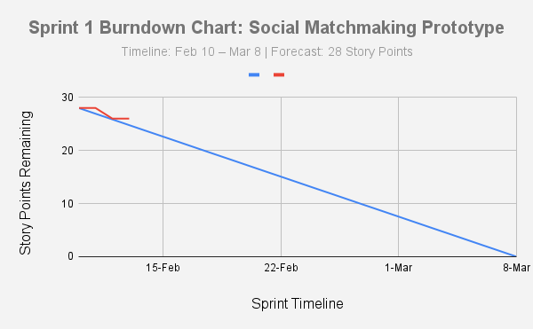

Sprint 1 Planning
Kanban Board: [Link to our Trello](https://trello.com/b/kbPXcjh0/social-matchmaking-sprint-1)

Forecast: 15 Story Points.

Rationale: Our team is focusing on the foundational Node.js environment, the core Web Service API connection, and the user behavior data structures. This ensures we have a stable, verifiable prototype by the February 24th deadline.

## 📈 Sprint 1 Burndown Chart

🛠️ Implementation Progress
Test-First Development (TDD) Evidence
To satisfy the rubric's requirement for building the product test-first, we established a failing behavioral test case (Red Phase) before writing any implementation logic.

### 🧪 Test-First Evidence

*Verification of failing behavioral test case before implementation.*

Task Decomposition
We have decomposed our Sprint 1 stories into specific technical tasks to ensure clear accountability:

External API: Researching Steam/Riot documentation, registering API keys, and creating the HTTP module.

User Profiles: Designing JSON schemas for attitude/play-style and building data-saving functions.
