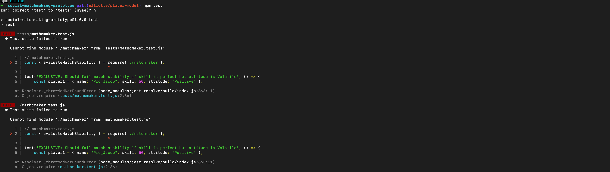
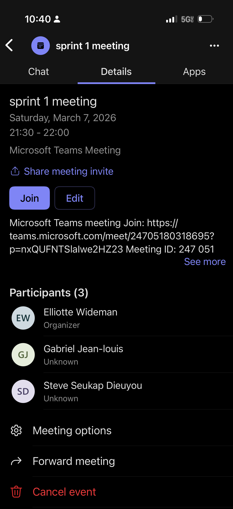

# Social Matchmaking Prototype – Sprint 1

This repository contains the **Sprint 1 prototype implementation** for the Social Matchmaking system.

The goal of Sprint 1 was to establish the foundational backend service using **Node.js and Express**, while following **Agile Scrum practices** and **Test-Driven Development (TDD)**.

---

# Sprint 1 Planning

## Kanban Board

Sprint backlog and task board:

[Trello Sprint Board](https://trello.com/b/kbPXcjh0/social-matchmaking-sprint-1)

This board contains the **user stories, tasks, and progress tracking** for Sprint 1.

---

## Sprint Forecast

**Forecast:** 28 Story Points

**Rationale**

Our team focused on building the foundational Node.js backend environment, implementing the core Web Service API endpoints, and defining user behavior data structures.

This ensures we have a stable prototype before the **March 8, 2026 deadline**.

---

# Sprint 1 Burndown Chart

<p align="center">

</p>

The burndown chart tracks the number of story points remaining throughout the sprint.

* X-Axis → Sprint Days  
* Y-Axis → Remaining Story Points

The chart demonstrates progress from **initial story points to zero remaining points** by the end of the sprint.

---

# Task Decomposition

Sprint stories were decomposed into technical tasks.

## External API Tasks

- Research Steam / Riot API documentation
- Register API keys
- Create HTTP request module
- Prepare service structure for external integrations

## User Profile Tasks

- Design JSON schemas for player behavior and play-style
- Build functions for storing and retrieving player data
- Implement data models for matchmaking inputs

---

# Implementation Progress

## Test-First Development (TDD)

To follow the rubric requirement of **building the product test-first**, the team created a failing behavioral test before implementing the functionality.

This represents the **Red phase of the TDD cycle**.

<p align="center">

</p>

The test initially failed, confirming that the behavior was not yet implemented.  
Implementation was then developed to make the test pass.

---

# Unit Testing

The project uses **Jest** for automated testing.

Testing includes:

- Behavioral test (BDD / A-TDD)
- Matchmaking compatibility tests
- Player profile validation tests
- Match stability logic

Run tests using:


The repository includes **more than 10 passing unit tests** as required by the sprint rubric.

---

# Pair Programming / Collaboration Evidence

The team collaborated through meetings and shared development sessions while building the API and testing components.

Evidence of collaboration is shown below.

---

# Sprint 1 Meeting Evidence

Our team conducted a coordination meeting to review progress and finalize sprint deliverables.

**Meeting Date:** March 7, 2026  
**Platform:** Microsoft Teams

### Participants

- Elliotte Wideman
- Gabriel Jean-Louis
- Steve Seukap Dieuyou

<p align="center">

</p>

This meeting demonstrates **team collaboration and coordination** during the sprint.

---

# Daily Scrum Evidence

Daily Scrum discussions addressed three key questions:

### What did you complete in the last 24 hours?

- Elliotte Wideman implemented the Express server and routing.
- Gabriel Jean-Louis researched external API documentation.
- Steve Dieuyou worked on the player profile schema.

### What will you complete in the next 24 hours?

- Implement the `/players` endpoint
- Integrate matchmaking service logic
- Add unit tests

### Impediments

- Initial uncertainty regarding API structure
- Resolved through team discussion and reviewing Express documentation.

---

# Working Software Increment

The Sprint 1 prototype includes a **working Node.js REST API**.

The API provides endpoints that return player data and enable matchmaking logic.

---

# API Prototype Demonstration

## API Home Endpoint

Endpoint:


Example Response:

```json
{
  "message": "Social Matchmaking API",
  "description": "Sprint 1 prototype matchmaking service",
  "endpoints": {
    "getPlayers": "GET /players",
    "createMatch": "POST /match"
  }
}

## GET /players

[
  {
    "id": 1,
    "username": "AcePlayer",
    "age": 22,
    "skillLevel": "Intermediate",
    "behaviorScore": 8,
    "preferredGameModes": ["Ranked","Duo"],
    "availability": "Evenings",
    "region": "NA-East",
    "platform": "PC",
    "bio": "Competitive team player."
  }
]
